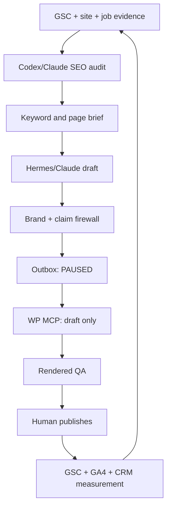

# M7 SEO System Map

## Executive decision

Build one controlled SEO operating system around four specialized components:

| Component | Job | Authority | Production boundary |
|---|---|---|---|
| **Codex SEO** | Primary audit, technical SEO, GSC analysis, content architecture, drift reports, and deterministic outputs in the Codex tab | Analysis and recommendations | Cannot publish |
| **Claude SEO** | Equivalent audit/content system inside Claude and Hermes | Analysis, briefs, and drafts | Cannot publish |
| **Local Competitor Map** | Google Places competitor discovery, ratings/reviews evidence, and geographic opportunity visualization | Research only | Cannot change GBP or WordPress |
| **WP MCP Ultimate** | Read WordPress state and deliver approved content to WordPress as drafts | Draft adapter only | No publish, delete, plugins, users, menus, options, redirects, or debug |

**System of record:** Google Search Console for queries, impressions, clicks, CTR, position, indexation, and sitemap status. GA4 and the CRM determine whether traffic becomes qualified leads, appointments, signed jobs, and revenue.

**Optional enrichment:** DataForSEO/OpenSEO may add live SERPs, backlinks, and geo-grid data, but the core loop must work without them. Never make a paid API the only path to operate the system.

**Migration rule:** Keep `pineapplecontractors.com` live while repairing `pineappleroofingllc.com`. Move authority only after destination parity exists and every source URL has an approved one-to-one 301 target. Keep control of the old domain for at least 6–12 months after the migration.

**Publishing rule:** Every generated page remains `PAUSED_PENDING_HUMAN_REVIEW` in `01_Command_Center/Outbox_Drafts/`. WP MCP may create a WordPress draft only after brief approval. A human performs the final publish or schedule action.

## Audit coverage and known limits

This map incorporates all nine supplied files:

- `M7_SEO_FULL_SEND.md`
- `M7_SEO_TRACKER.md`
- `M7_SITE_MIGRATION_MASTER_PLAN.md`
- `M7_STUDIO_FEATURES_MASTER_SOP.md`
- `M7_STUDIO_TAB_GALLERY.md`
- `WP_AI_Bridge_SOP.md`
- `M7_MASTER_EXECUTION_SOP.md`
- `M7_ICM_RESTRUCTURE_AUDIT.md`
- `m7_global_config.json`

It also verifies the public repositories for WP MCP Ultimate, Claude SEO, Codex SEO, and Local Competitor Map, plus the current public homepage.

The Windows folder `C:\Pineapple Contractors M7\01_Command_Center\Outbox_Drafts` and the local zip at `C:\Users\estim\Downloads\wp-mcp-ultimate-main.zip` were not available to this workspace. The private `saia-collab/pineapple-m7-vault` repository also returned 404 through the connected GitHub account. Therefore:

- Outbox filenames reported by the SOPs are treated as inventory claims, not byte-level verification.
- The uploaded WordPress zip is **unverified** until its plugin header, commit, checksum, and activation status are checked on the Windows PC or staging WordPress.
- No GitHub commit, WordPress activation, credential creation, live edit, redirect, or publication was performed.

## Gate 0 — stop current website leaks

The live homepage check on 2026-08-14 found that:

- “Get a Free Quote,” “Get your FREE Quote Today,” and related banned language are still public.
- No “Complimentary” wording was detected on the homepage.
- Contact, Process, About Us, and Reviews still resolve to the homepage.
- The homepage is Dallas-led while the visible address is Lewisville; the approved configuration identifies Frisco as headquarters and Lewisville as a branch.
- The homepage says “fully licensed” without the required RCAT-specific wording.
- No visible IKO wording was detected on the homepage.

These defects outrank new article production because they affect every visitor.

### Gate 0 work order

1. Back up WordPress files and database.
2. Fix Contact, Process, About, and Reviews navigation targets.
3. Replace all banned offer wording with **Complimentary Professional Photo Audit (CPPA)** language, including form buttons and consent text.
4. Change licensing copy to **RCAT Licensed Roofing Contractor #03-0637**; do not claim a statewide Texas general-contractor license.
5. Confirm current IKO evidence before publishing IKO claims.
6. Resolve the primary location message: Frisco headquarters, Lewisville branch, DFW service area.
7. Noindex the thank-you page and remove the repeated form from it.
8. Confirm one Pineapple-owned GTM container, one primary GA4 property, call tracking, and form events.
9. Re-crawl the live site and record PASS/FAIL evidence.

## The complete SEO operating loop



### Stage contracts

| Stage | Input | Responsible feature | Required output | Gate |
|---|---|---|---|---|
| 1. Evidence intake | GSC export, sitemap, live URLs, job photos, reviews, claims evidence | Notebook / Drive / Outbox intake | Source packet with provenance | Unknown claims excluded |
| 2. Baseline audit | Both domains and GSC properties | Codex SEO primary; Claude SEO cross-check | Technical, local, content, schema, sitemap, GEO, and SXO reports | Findings tied to URL/evidence |
| 3. Opportunity scoring | Queries and landing pages | Codex SEO + GSC | Prioritized keyword-to-page backlog | Revenue intent beats raw volume |
| 4. Competitor evidence | Business/category + city | Local Competitor Map | Named competitor list and Places evidence | Research only; no invented gaps |
| 5. Brief | One target page | Codex SEO `content-brief` or Claude SEO | Intent, audience, evidence, outline, links, schema, CTA, KPI | Human approves brief |
| 6. Draft | Approved brief | Hermes SEO pipeline or Claude | One evidence-led draft | No mass thin pages |
| 7. Firewall | Draft + global config | Claude brand pass + deterministic checks | PASS or exact violations | CPPA/IKO/RCAT/phone/colors |
| 8. Outbox | Passed draft | Local Studio | Versioned PAUSED file | Never public by default |
| 9. WordPress draft | Approved Outbox item | WP MCP Ultimate | Draft post/page/media + WP ID + revision | Dedicated least-privilege account |
| 10. QA | Rendered draft | Codex/Claude + human | Mobile/desktop, metadata, links, schema, form, tracking PASS | Block on material failure |
| 11. Release | QA-passed WP draft | Human publisher | Live URL + release note | Explicit human authorization |
| 12. Measure | Live URL | GSC, GA4, GBP, calls, CRM | 7/28/56-day scorecard | Signed-job/revenue feedback |
| 13. Refresh | Scorecard | Codex SEO drift + GSC | Refresh, merge, expand, or hold decision | Avoid content churn without evidence |

## Local Studio tab map

| Tab/profile | Exact role in this system | Standard command or prompt | Output location |
|---|---|---|---|
| **Codex** | Primary technical auditor and system planner | “Run the M7 baseline SEO audit for both domains. Apply `m7_global_config.json`. Do not publish.” | `Outbox_Drafts/SEO/Audits/` |
| **Claude** | Customer-facing copy and final brand lock | “Check this draft against PM7 brand law and the claims packet. Return PASS or exact fixes.” | Same content folder |
| **Hermes → seo-lead** | Coordinates a bounded SEO sprint | “Build only the approved brief IDs. One URL per intent. PAUSED output only.” | `Outbox_Drafts/SEO/` |
| **Hermes → SEO Content Pipeline** | Batch drafting after a cluster is approved | One approved seed/cluster; no direct deployment | `Outbox_Drafts/SEO/` |
| **Local Competitor Map** | Places discovery and visual competitor radius | `/competitors roofing contractor in Frisco, Texas` | `Outbox_Drafts/SEO/Competitors/` export/screenshot |
| **Notebook** | Julian Goldie/SOP/source retrieval | “Return only source-backed methods relevant to the approved brief.” | Research packet |
| **Kanban / Agent Kanban** | Work-state orchestration | Load approved backlog rows; no auto-publish step | Board |
| **Pipeline** | Intake-to-approved-deliverable workflow | Require one human plan approval before drafting | Pipeline state |
| **WP MCP** | WordPress read + draft adapter | “Create/update DRAFT `<content-id>` only. Return WP ID and revision.” | WordPress draft |
| **Mission Control** | Read-only health and status | Show audit freshness, blocked gates, and queue counts | Dashboard |

### Do not duplicate the SEO engines

- In the **Codex tab**, use `codex-seo` as the native skill suite.
- In the **Claude tab/Hermes**, use `claude-seo`.
- Do not run both full audits every day. Run one primary audit, use the other only for a disputed/high-risk finding, and record the resolution.
- Keep output contracts identical so reports land in the same M7 folders and board states.

## Website information architecture

### Tier 1 — repair and trust pages

| Priority | Page | Primary job | Target theme | Required proof |
|---:|---|---|---|---|
| 1 | Homepage | Brand + DFW roofing conversion | Pineapple Roofing / DFW roofing contractor | RCAT, verified IKO, review proof, CPPA, locations |
| 2 | About | Family/company trust | Pineapple Roofing company | Real team story, dates, photos, leadership |
| 3 | Reviews | Customer proof | Pineapple Roofing reviews | Verifiable reviews and sources |
| 4 | Process | Reduce uncertainty | Roofing process / CPPA | Actual inspection-to-completion steps |
| 5 | Contact | Call/text/form conversion | Contact Pineapple Roofing | Correct NAP, service area, consent |
| 6 | Insurance Claims | Documentation help | Roof insurance claims help DFW | Careful, non-guaranteed claim language |
| 7 | Financing | Financing education | Roof financing DFW | Current provider terms and disclaimers |
| 8 | Gallery/Projects | Local E-E-A-T | DFW roofing projects | Real photos, city, system, outcome |

### Tier 2 — service hubs

Create or strengthen unique pages for:

1. Residential roofing
2. Commercial roofing
3. Roof replacement
4. Roof repair
5. Storm and emergency roof repair
6. Hail damage documentation / CPPA
7. Metal roofing
8. TPO roofing
9. Shingle roofing
10. Tile and slate roofing
11. Gutters
12. Siding

Each service page needs one clear intent, real Pineapple experience, a relevant project/example, internal links to priority cities, visible CTA, BreadcrumbList, Service schema where appropriate, and no unsupported warranty/certification/insurance claim.

### Tier 3 — location architecture

Use a location hub plus unique city pages. Prioritize with current GSC evidence, not a static city list.

**Seed priority from the supplied SOPs:**

1. Allen — especially `flat roofing allen tx` / roof replacement evidence
2. Grapevine
3. Euless
4. Frisco
5. Plano
6. McKinney
7. Lewisville
8. The Colony
9. Flower Mound
10. Little Elm
11. Prosper
12. Fort Worth
13. Arlington
14. Dallas
15. Irving

**Location-page quality gate:** at least 60% non-swappable content, real local project/service evidence, accurate service boundary, unique title/H1/meta, useful local answer blocks, links to the right service pages, and a non-fabricated testimonial. Do not create ZIP or city doorway pages merely by swapping place names.

### Tier 4 — topical support clusters

Build supporting content only when it strengthens a money page or answers a GSC-demonstrated question:

- Hail damage and hidden roof damage
- Roof repair versus replacement
- What a CPPA documents
- North Texas storm preparation
- Insurance documentation process without approval guarantees
- Roofing material comparisons for North Texas weather
- Commercial TPO and property-manager maintenance
- Financing questions with current disclosures
- Project case studies by city and roofing system

Every supporting article must link to one parent service/city page and at least one related answer. Parent pages link back where useful.

## Keyword-to-page decision rules

1. **Existing page already ranks positions 5–20:** improve that page first; do not create a competing URL.
2. **Same intent, multiple weak URLs:** choose one canonical winner, merge useful content, and redirect only after review.
3. **New intent with real demand and proof:** create one new page.
4. **City + service combination without unique evidence:** hold in backlog; do not generate a doorway page.
5. **Brand query:** homepage is the canonical target.
6. **Question query:** answer within the relevant service/city page unless it warrants a genuinely distinct resource.
7. **FAQ markup:** useful FAQs may remain for users, but do not promise Google FAQ rich results. Use QAPage only for genuine user Q&A pages.
8. **Schema:** use the most accurate type; never add self-serving LocalBusiness review markup or properties not visible/true on the page.

## Opportunity scoring

Score each backlog item from 0–5 in each field:

| Factor | Weight | Meaning |
|---|---:|---|
| Revenue intent | 25% | Replacement, repair, storm, commercial, or booked inspection likelihood |
| GSC opportunity | 20% | Impressions with low CTR or average position 5–20 |
| Existing authority | 15% | Current ranking page, backlinks, age, or strong old-domain URL |
| Local strategic value | 15% | Priority market and operational serviceability |
| Evidence readiness | 10% | Photos, reviews, projects, claims, and SME input exist |
| Conversion readiness | 10% | CTA, form, phone, tracking, and follow-up path work |
| Effort inverse | 5% | Smaller lift scores higher |

`Priority score = sum(factor score × weight)`.

Do not let keyword volume overrule evidence, serviceability, or revenue intent.

## Julian Goldie method — PM7-safe adaptation

Use the useful operating pattern without copying unverified volume or income claims:

1. Find the keywords/pages already receiving impressions.
2. Select one commercial seed and map its real supporting questions.
3. Refresh the existing ranking page before creating a duplicate.
4. Build a small hub-and-spoke cluster around the commercial page.
5. Use agents for research, briefs, drafting, linking, and QA.
6. Keep humans responsible for evidence, judgment, brand, and publication.
7. Measure traffic and leads; refresh winners and stop producing content that does not help.

For PM7, “one keyword → five articles” means **one approved cluster with five distinct intents**, not five thin variations of the same answer.

## Local competitor intelligence map

### Standard research runs

Run these first in the Local Competitor Map:

- `/competitors roofing contractor in Frisco, Texas`
- `/competitors roofing contractor in Lewisville, Texas`
- `/competitors commercial roofing contractor in Dallas-Fort Worth, Texas`
- `/competitors metal roofing contractor in Plano, Texas`
- `/competitors roof repair in Allen, Texas`
- `/competitors roofing company in Grapevine, Texas`
- `/competitors roofing contractor in Euless, Texas`

For each result, record:

- Business name and Places URL
- City/radius/category
- Rating and review count as observed date-stamped data
- Primary category and secondary service signals
- Website URL and landing page
- Review themes, photos, response behavior, and evident differentiators
- Content/UX opportunity that Pineapple can prove, not merely imitate

### Boundaries

- The map uses Gemini and Google Maps/Places keys and Google billing. Set API restrictions, quotas, and budget alerts.
- Browser/localStorage keys are not suitable for a public production deployment. Keep the tool local during the pilot; for public deployment, place secrets behind a controlled server-side proxy.
- Do not store keys in GitHub, Outbox, screenshots, prompts, Documents, or WordPress.
- Places rankings/ratings are observations, not guaranteed SEO causes.

## Installation and version-control plan

Do not use moving `main` branches in production. Pin a reviewed release or commit, record its checksum, and keep rollback instructions.

| Repository | Approved pilot candidate | Purpose | Current decision |
|---|---|---|---|
| [AgriciDaniel/codex-seo](https://github.com/AgriciDaniel/codex-seo) | Release `v1.9.6-codex.5` | Codex-native SEO engine | Pilot after local review and verification |
| [AgriciDaniel/claude-seo](https://github.com/AgriciDaniel/claude-seo) | Release `v2.2.4` | Claude/Hermes SEO engine | Pilot after local review and verification |
| [AgriciDaniel/local-competitor-map](https://github.com/AgriciDaniel/local-competitor-map) | Release `v0.1.0` or reviewed commit `332b2de…` | Local competitor visualization | Local-only pilot with restricted keys |
| [AgriciDaniel/wp-mcp-ultimate](https://github.com/AgriciDaniel/wp-mcp-ultimate) | No automatic production approval | WordPress draft bridge | **HOLD** until a reviewed v2.1.0 artifact is pinned and staged |

### Important WP MCP discrepancy

As of 2026-08-14:

- The latest tagged release is `v1.1.0`.
- The main branch/plugin header identifies `v2.1.0` at commit `d5eff50f…`.
- The repository documents 58 abilities, while other repository surfaces contain inconsistent 57/68 counts.

Therefore, do not assume the uploaded `wp-mcp-ultimate-main.zip` is safe or know its ability surface from its filename. Verify the exact plugin version/commit and run ability discovery in staging. Production activation remains blocked until the acceptance tests pass.

### Safe Windows layout

```text
C:\Pineapple Contractors M7\
├── 01_Command_Center\
│   ├── Playbooks\M7_SEO_SYSTEM_MAP_2026-08-14.md
│   └── Outbox_Drafts\SEO\
├── 03_Knowledge_Mat\Resources\SEO\
│   ├── Julian_Goldie\
│   └── Repository_Reviews\
└── 04_Tech_Lab\SEO_Tools\
    ├── codex-seo\
    ├── claude-seo\
    └── local-competitor-map\
```

Do not move the root M7 runtime files or change existing paths until the ICM structural moves are separately approved and dependency-checked.

### Pilot installation sequence

1. Create a restore point and record current Local Studio health.
2. Clone the repos into `04_Tech_Lab\SEO_Tools\` at reviewed tags/commits.
3. Review installer diffs before execution; do not pipe remote scripts directly into PowerShell.
4. Install Codex SEO into the Codex skill/agent paths; restart Codex; run its environment verification and one no-credential audit.
5. Install Claude SEO separately for Claude/Hermes; run `/seo doctor` before `/seo setup` or live API work.
6. Run Local Competitor Map locally with Node 18+; restrict Gemini/Maps keys; test one deterministic `/competitors` query.
7. Confirm outputs land in the M7 Outbox rather than tool-repository `output/` folders; use a copy/export step if needed.
8. Record version, commit, checksum, dependencies, test output, credential owner, costs, and uninstall/rollback steps.
9. Do not activate WP MCP on production. Verify the uploaded zip, create staging, and follow the WordPress acceptance gates below.

## WP MCP draft-only permission model

### Allowed pilot surface

- Site information and ability discovery
- List/get/search posts and pages
- List revisions
- List/get media
- Create/update **draft** posts and pages
- Upload approved media and set accurate alt text
- Assign approved categories/tags only when the dedicated role permits them

### Prohibited surface

- Publish or schedule
- Delete posts, pages, media, comments, users, or plugins
- Create/edit/delete users or roles
- Install, activate, deactivate, overwrite, or delete plugins
- Change menus, widgets, homepage, global options, permalinks, redirects, or theme settings
- Read/toggle debug or modify `wp-config.php`
- Bulk actions

### Authentication choice

For the Local Studio pilot, prefer a dedicated Application Password on a tightly scoped WordPress account. If OAuth is not needed, disable the bundled OAuth server in staging and production. Never use the everyday administrator account for content operations.

### Acceptance gates

| Gate | Evidence required | Result needed |
|---|---|---|
| Artifact identity | Version, commit, checksum, source URL | Exact match |
| Backup/restore | Successful staging restore | PASS |
| Compatibility | WP 6.7+, PHP 8.0+, HTTPS, pretty permalinks, REST | PASS |
| Least privilege | Role/capability export | No prohibited capabilities |
| Read-only test | Site/list/get/search | PASS |
| Canary draft | One uniquely named draft + one revision | Remains unpublished |
| Media test | One approved image + accurate alt | PASS |
| Block test | Publish/delete/users/plugins/options/debug | All fail |
| Auditability | User, timestamp, revision/activity evidence | PASS |
| Revocation | Revoke credential; access stops immediately | PASS |
| Performance | No customer-facing errors/timeouts | PASS |
| Rollback | Deactivate, revoke, and restore rehearsed | PASS |

## SEO Kanban data model

Use these states:

1. `BACKLOG`
2. `EVIDENCE_READY`
3. `BRIEF_PENDING_APPROVAL`
4. `BRIEF_APPROVED`
5. `DRAFTING`
6. `BRAND_QA`
7. `OUTBOX_PAUSED`
8. `WP_DRAFT`
9. `QA_BLOCKED` or `READY_FOR_HUMAN_PUBLISH`
10. `PUBLISHED`
11. `MEASURING`
12. `REFRESH`, `MERGE`, `EXPAND`, or `HOLD`

### Required card fields

| Field | Example |
|---|---|
| Content ID | `M7-SEO-ALLEN-FLAT-001` |
| Domain phase | `legacy-improve`, `new-build`, or `migration` |
| Source URL | Existing/legacy URL |
| Target URL | Canonical destination |
| Query/intent | `flat roofing allen tx` / commercial investigation |
| Parent cluster | Commercial roofing → TPO/flat roofing → Allen |
| GSC baseline | Clicks, impressions, CTR, position, date range |
| Opportunity score | Weighted score from this map |
| Evidence packet | Project, review, photo, certification, SME notes |
| Internal links | Parent, child, sibling, CTA target |
| Schema candidates | BreadcrumbList, Service, LocalBusiness, Article, etc. |
| Owner | AI drafter, VA, Saia, publisher |
| Status | One board state only |
| WP ID/revision | Returned by WP MCP |
| Redirect | Source → target + test result |
| Release | Publisher, date, live URL |
| KPI | GSC + leads + appointments + signed jobs + revenue |

## 301 migration map contract

The redirect CSV is the most important migration artifact. Required columns:

```text
source_url,target_url,source_status,target_status,page_type,primary_query,gsc_clicks_90d,gsc_impressions_90d,backlink_note,content_parity,canonical_ready,redirect_type,test_status,owner,approved_by,go_live_date,notes
```

Rules:

- One source URL maps to the closest equivalent destination.
- Do not redirect unrelated pages to the homepage.
- Publish and QA the destination before enabling the redirect.
- Update canonicals, internal links, sitemaps, GBP, directories, ads, and profiles.
- Test status code, redirect chain, final canonical, robots, page content, analytics, and form path.
- Keep old and new GSC properties monitored throughout migration.
- Use Search Console Change of Address only when the move is technically complete and approved.

## Quality firewall

Every draft must pass:

- No banned terms from `m7_global_config.json` in public copy.
- Primary CTA: **Reserve Your Complimentary Professional Photo Audit** or an explicitly approved equivalent.
- Phone: `(972) 928-0788`.
- License: **RCAT Licensed Roofing Contractor #03-0637**.
- IKO only with current evidence; never auto-replace a claim without checking grammar and truth.
- No green; navy `#1A365D`, gold `#FBC02D`, cyan `#00BFFF`, paper `#F7F5EF` where used.
- No invented reviews, ratings, projects, locations, awards, warranty terms, pricing, certifications, years, or outcomes.
- Answer the primary query quickly, but do not enforce arbitrary length when a shorter complete answer is better.
- One H1; accurate title/meta; self-canonical; index directive; descriptive URL.
- Unique local evidence; no city-name swapping.
- Descriptive image filenames, WebP/AVIF where practical, accurate alt text, dimensions, lazy loading below the fold.
- Internal links are relevant and not forced.
- Schema matches visible page content and validates.
- Forms, call, text, consent, thank-you flow, and analytics events work.
- Mobile and desktop rendered QA completed.

## Measurement scoreboard

### Leading indicators

- Valid indexed pages
- 404/soft-404/canonical errors
- Queries/pages in positions 5–20
- CTR by page/query
- Internal-link coverage
- Core Web Vitals/pass rate
- GBP completeness, review velocity, and NAP consistency
- Content production by board state, not raw article count

### Business outcomes

- Qualified calls/forms/texts
- Booked CPPAs
- Inspections completed
- Proposals issued
- Signed jobs
- Revenue and gross profit by landing page/source
- Cost per booked CPPA and cost per signed job
- Speed to lead, target under five minutes and operational goal near 60 seconds when staffed

### Review cadence

- **Daily:** broken forms/navigation, crawl/index emergencies, Outbox approvals, lead routing.
- **Weekly:** GSC striking-distance pages, new/updated pages, GBP/reviews, redirect logs, lead quality.
- **Monthly:** cluster performance, signed-job attribution, content merge/hold decisions, competitor evidence refresh.
- **Quarterly:** full technical/local audit, migration batch decision, provider costs, credentials, rollback test.

## 90-day rollout

### Days 0–7 — repair and baseline

- Complete Gate 0 website repairs.
- Verify the uploaded WP MCP zip identity; keep production inactive.
- Connect/verify GSC for both domains and export page/query data.
- Export the complete legacy URL inventory and begin the redirect CSV.
- Install and verify Codex SEO at the pinned release; run baseline audits.
- Add this system map to `01_Command_Center/Playbooks/` and the Local Studio SEO tab routing.

### Days 8–30 — controlled production

- Approve and improve the strongest existing pages in positions 5–20.
- Publish the already-drafted Frisco, Allen, and Grapevine pages only after evidence and duplication checks.
- Run the seven Local Competitor Map seed queries.
- Build/repair About, Reviews, Process, Contact, Project Gallery, and the service hub.
- Complete WP MCP staging, least-privilege, canary, block, revocation, and rollback tests.
- Turn approved Outbox items into WordPress drafts; humans publish.

### Days 31–60 — authority transfer pilot

- Select a small batch of high-value legacy URLs using GSC/backlink/business value.
- Build destination parity, QA, and one-to-one redirects.
- Monitor both GSC properties, 404s, canonicals, rankings, and leads.
- Expand the highest-performing city/service clusters with real project proof.
- Return qualified and signed-job outcomes to analytics/ad platforms where configured.

### Days 61–90 — scale what wins

- Increase output only for clusters producing qualified appointments and signed jobs.
- Migrate the next proven legacy batch.
- Build commercial TPO/metal/property-manager content if sales capacity supports it.
- Run drift checks and merge/hold low-value duplicate content.
- Decide whether DataForSEO/OpenSEO geo-grid/backlink enrichment is worth the cost.

## First seven execution cards

1. `M7-WEB-GATE0-NAV` — fix Contact, Process, About, Reviews routes.
2. `M7-WEB-GATE0-CPPA` — replace all banned offer wording sitewide after dry run.
3. `M7-WEB-GATE0-CLAIMS` — correct RCAT, location, insurance, and verified IKO language.
4. `M7-SEO-GSC-BASELINE` — connect both domain properties and export 90-day page/query data.
5. `M7-SEO-URL-MAP` — inventory all legacy URLs and begin the redirect CSV.
6. `M7-SEO-CODEX-INSTALL` — review, pin, install, verify, and run Codex SEO baseline.
7. `M7-WP-MCP-VERIFY` — identify uploaded zip/version/checksum; staging only; no production activation.

## Reusable prompts

### Codex baseline prompt

```text
Run the M7 SEO baseline for https://pineappleroofingllc.com and https://www.pineapplecontractors.com using Codex SEO. Read m7_global_config.json and the approved claims packet first. Audit technical SEO, sitemap/indexation, local/NAP, schema, content quality, GEO/SXO, internal links, conversion paths, and migration risks. Use GSC as the system of record when connected. Output URL-level findings, dependency order, failure checks, leading indicators, and a prioritized ACTION-PLAN.md. Do not publish or change either site. Land every artifact PAUSED in 01_Command_Center/Outbox_Drafts/SEO/Audits/.
```

### Striking-distance brief prompt

```text
For content ID [ID], use the attached GSC page/query export and existing URL. Decide whether to refresh, merge, or create. Produce one evidence-led brief with intent, target query, audience, answer-first summary, unique Pineapple proof needed, outline, internal links, schema candidates, CPPA CTA, and 7/28/56-day KPI. Apply PM7 brand law. If evidence is missing, return BLOCKED with the exact missing evidence. Do not draft or publish until the brief is approved.
```

### Claude brand-lock prompt

```text
Review content ID [ID] against m7_global_config.json and its evidence packet. Check CPPA language, RCAT wording, current IKO evidence, phone, locations, colors, insurance/financing claims, reviews, warranty, project facts, local uniqueness, internal links, metadata, schema consistency, and CTA. Return PASS or a table of exact violations and corrected wording. Do not publish. Save the passed version PAUSED in Outbox_Drafts.
```

### WP MCP draft command

```text
APPROVE WORDPRESS DRAFT [CONTENT-ID]. Using the dedicated PM7 content account, create or update only a WordPress DRAFT from the approved Outbox file. Upload only approved media, set accurate alt text, preserve the approved slug, and return the WP ID, status, revision, preview URL, and actions taken. Do not publish, schedule, delete, change menus/options/plugins/users/redirects, or make unrelated edits.
```

## Sources checked

- [WP MCP Ultimate repository](https://github.com/AgriciDaniel/wp-mcp-ultimate)
- [WP MCP Ultimate setup](https://github.com/AgriciDaniel/wp-mcp-ultimate/blob/main/docs/SETUP.md)
- [WP MCP Ultimate security](https://github.com/AgriciDaniel/wp-mcp-ultimate/blob/main/SECURITY.md)
- [WP MCP Ultimate abilities](https://github.com/AgriciDaniel/wp-mcp-ultimate/blob/main/docs/ABILITIES.md)
- [Claude SEO repository](https://github.com/AgriciDaniel/claude-seo)
- [Codex SEO repository](https://github.com/AgriciDaniel/codex-seo)
- [Local Competitor Map repository](https://github.com/AgriciDaniel/local-competitor-map)
- [Pineapple Roofing live homepage](https://pineappleroofingllc.com/)
- [Julian Goldie website](https://juliangoldie.com/)

---

**The next move is not more content.** Complete Gate 0, connect both GSC properties, and verify the uploaded WP MCP artifact. Then the M7 machine can safely turn evidence into drafts, drafts into approved WordPress pages, and pages into tracked signed jobs.

<!-- M7-FIREWALL-EXEMPT: governance-reference; banned terms appear only as audit findings and firewall rules -->
