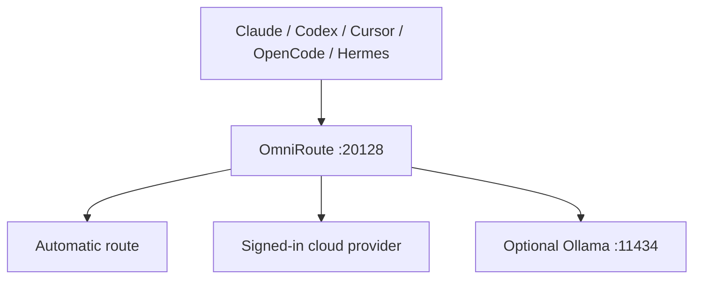

# M7 Local Studio study guide

## The one idea to remember

OmniRoute is a gateway, not a model. Claude Code, Codex, Cursor, OpenCode, and Hermes send a request to OmniRoute; OmniRoute chooses a model/provider that is currently available and authorized.



## Why the old setup broke

- Launchers set fake placeholder API keys and continued even when the gateway was unavailable.
- Several authority files disagreed about the brand, founding year, offer, colors, and ports.
- Model IDs were hardcoded even though provider catalogs and free tiers change.
- The Studio launcher existed only as a dated backup while the root "Studio" launcher merely opened Claude Code.
- A local Obsidian REST credential was committed to the public repository instead of being read from an environment variable.
- Historical receipts were treated as proof of current health.

## Which mode should I use?

| Need | Button | What pays/runs it |
|---|---|---|
| Open the full PM7 interface | `LAUNCH_PM7_STUDIO.bat` | local services plus configured providers |
| Claude Code through OmniRoute | `LAUNCH_PM7_FREE.bat` | current free tiers or configured provider accounts; availability can change |
| Claude Code subscription | `LAUNCH_PM7_PAID.bat` | signed-in Claude plan |
| Codex through OmniRoute | `omniroute launch-codex` | current OmniRoute route/context |
| Local offline fallback | Ollama, optional | computer RAM/CPU; no cloud provider |

"Free" means the selected provider is offering usable no-cost capacity now. It is not a permanent promise. Always inspect the live receipt and provider dashboard.

## Correct endpoint shapes

- Claude/Anthropic base URL: `http://127.0.0.1:20128` — no `/v1`; Claude appends its messages path.
- Codex/OpenAI-compatible base URL: `http://127.0.0.1:20128/v1`.
- Use `ANTHROPIC_AUTH_TOKEN` or OmniRoute's launcher/context for Claude. Do not commit it.
- Use a scoped OmniRoute endpoint token when authentication is enabled. Do not use a made-up token.

## Configure the tools

The recommended one-click path is `CONFIGURE_PM7_AI_CLIENTS.bat`. It runs the upstream-supported setup commands:

```powershell
omniroute setup-claude
omniroute setup-codex
omniroute setup-opencode
omniroute setup-cursor
```

Cursor's settings are stored by Cursor itself, so `setup-cursor` prints steps you complete in Cursor → Settings → Models. A repository `.cursor/settings.json` is not proof that Cursor's chat model is configured.

## Model selection on 16 GB RAM

Use cloud-routed text models for the main workload. Keep only one OmniRoute service and one Studio instance open.

- Preferred: `auto/best-chat`, `auto/best-coding`, `auto/best-reasoning`.
- Provider families to look for: DeepSeek, Kimi, GLM, MiniMax.
- Ollama: start with an installed 1.5B–3B quantized model. A 7B model may work if enough RAM is free; test before making it a default. Avoid 9B+ while Studio, browsers, and Cursor are open.
- Do not install `deepseek-harness` just to access DeepSeek. It is a separate agent application and adds another large runtime. Revisit it only after the core PM7 stack passes consistently.

## What counts as proof

A green dashboard is not enough. The current verification receipt must show:

1. Studio, Hermes, and OmniRoute ports reachable.
2. Three model requests return `PM7_ROUTE_OK` or are explicitly marked NOT TESTED because authentication is missing.
3. No secret appears in the receipt.
4. Optional services are labeled optional, not falsely reported as core failures.
5. The receipt date and computer name match the machine being tested.

## Secret handling

The Obsidian Local REST key is read only from `OBSIDIAN_REST_API_KEY`. Because an older key was committed publicly, rotate it in the Obsidian plugin before trusting it again. Git removal does not invalidate a credential already present in history.

## Publishing safety

Model success never bypasses DEC-005. Pages, posts, messages, and ad changes remain PAUSED in `Outbox_Drafts/` until Saia gives GO.

<!-- M7-FIREWALL-EXEMPT: governance-reference -->
