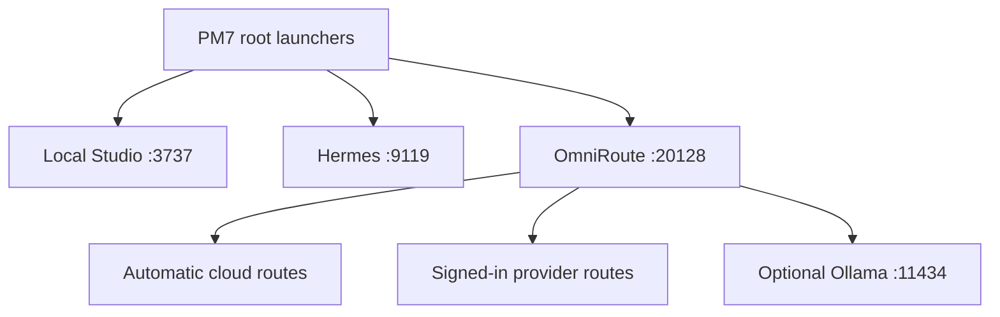

# PM7 Local Studio and OmniRoute recovery SOP

## Executive state

The PM7 repository contained a working 2026-08-16 service launcher, but the two root launchers did not use it. They set placeholder keys, checked the gateway without stopping on failure, and opened Claude Code instead of reliably starting the full Studio. The active agent boot chain also mixed the current 2026-08-14 rules with retired June/July rules.

This recovery makes the following files authoritative:

1. Root `CLAUDE.md`
2. Root `CONTEXT.md`
3. `03_Knowledge_Mat/SHARED_MEMORY.md`
4. `03_Knowledge_Mat/AGENT_READ_ME_FIRST.md`
5. This SOP for Local Studio, OmniRoute, launchers, and models

`M7_MASTER_SOP.md` is historical. `M7_MASTER_SOP_AND_VERIFICATION_MATRIX.md` is a 2026-08-19 test snapshot, not proof that the same providers or model count work today.

## Evidence scanned

- Current `saia-collab/pineapple-m7-vault` repository: 3,291 indexed nodes and 2,457 files at audit time.
- Current `diegosouzapw/OmniRoute` default branch `release/v3.8.50`, including its setup, Claude, Codex, Cursor, provider, remote, and memory documentation.
- Current `diegosouzapw/deepseek-harness` default branch `master` to decide whether it belongs in the 16 GB runtime.
- Uploaded PM7 handoff DOCX, troubleshooting guide, free-routing note, two launchers, and two verification receipts.

The uploaded handoff is not execution-safe: it uses the wrong vault root, retired brand rules, malformed Markdown-expanded PowerShell URLs, and unverified provider/model assumptions. The uploaded troubleshooting guide is incomplete. The two uploaded launchers are duplicates in behavior and neither starts the full Studio. Preserve them as evidence, not instructions.

## Supported architecture



| Component | Current endpoint | Policy |
|---|---|---|
| Local Studio | `http://127.0.0.1:3737/hermes` | one instance only; old `:3000` Studio is retired |
| Hermes | `http://127.0.0.1:9119` | orchestration/dashboard |
| OmniRoute | `http://127.0.0.1:20128` | Anthropic clients use root URL |
| OpenAI-compatible API | `http://127.0.0.1:20128/v1` | Codex, OpenCode, and compatible clients |
| Free Claude proxy | `http://127.0.0.1:8082` | optional; authentication may be required |
| M7 backend | `http://127.0.0.1:51763/api/health` | optional supporting service |
| Notebook/Obsidian bridge | `http://127.0.0.1:8643` | optional supporting service |
| Ollama | `http://127.0.0.1:11434/api/tags` | optional lightweight local fallback |

Obsidian desktop recovery and shared-memory configuration are governed by `01_Command_Center/Playbooks/Obsidian_Memory_Recovery_Playbook.md`. The official Local REST API uses loopback HTTPS `https://127.0.0.1:27124`; it is separate from the optional legacy notebook bridge on `:8643`.

## One-time recovery on the Windows desktop

1. Rotate the exposed Obsidian Local REST API token, OpenAI project key, Google API key, and Omega Indexer key. They appeared in committed public files; removing them from the current tree does not remove them from Git history.
2. Resolve the Google Drive/Git conflict before pulling: pause Drive sync for the repository (or move the Git working copy outside Drive), remove only verified `desktop.ini` junk from `.git/refs`, and confirm `git fetch` succeeds.
3. Pull the approved PM7 recovery change into `C:\Pineapple Contractors M7`.
4. Double-click `PM7_OBSIDIAN_RECOVER.bat`; use its receipt to recover the UI workspace and focus Local Studio memory on `03_Knowledge_Mat`.
5. Confirm Node.js and npm are installed.
6. Install or update OmniRoute from its official package:

   ```powershell
   npm install -g omniroute
   omniroute --version
   ```

7. Start OmniRoute/Studio with `LAUNCH_PM7_STUDIO.bat`.
8. In the OmniRoute dashboard, create or select a scoped endpoint token if authentication is enabled. Add provider OAuth sessions or keys only inside OmniRoute/provider credential storage.
9. Double-click `CONFIGURE_PM7_AI_CLIENTS.bat`. It uses the live catalog to generate Claude, Codex, and OpenCode profiles and prints Cursor's exact in-app settings.
10. Double-click `PM7_REPAIR_AND_VERIFY.bat`.
11. Open the newest `PM7_LOCAL_VERIFY_*.md` receipt in `01_Command_Center/Outbox_Drafts/`. Do not claim completion unless Studio, Hermes, OmniRoute, and the required model routes pass or authentication is explicitly identified as the only blocker.

## Daily launch choices

| Goal | Launcher/command |
|---|---|
| Open the complete PM7 Studio | `LAUNCH_PM7_STUDIO.bat` |
| Use Claude Code through OmniRoute | `LAUNCH_PM7_FREE.bat` |
| Use paid Claude subscription separately | `LAUNCH_PM7_PAID.bat` |
| Use Codex through OmniRoute | `omniroute launch-codex` |
| Use Gemini CLI through OmniRoute | `LAUNCH_PM7_GEMINI.bat` |
| Rebuild all supported client profiles | `CONFIGURE_PM7_AI_CLIENTS.bat` |
| Connect Gemini/Google AI Studio/Antigravity | `CONFIGURE_PM7_GOOGLE_AI.bat` (human OAuth/key step required) |
| Diagnose/retest | `PM7_REPAIR_AND_VERIFY.bat` |

The free-routed launcher calls `omniroute launch`. OmniRoute injects the correct root URL and active scoped token. The paid launcher clears `ANTHROPIC_BASE_URL`, `ANTHROPIC_API_KEY`, `ANTHROPIC_AUTH_TOKEN`, `OPENAI_BASE_URL`, and `OPENAI_API_KEY` only inside that process, preventing accidental crossover.

## Model routing policy

Use automatic routes for stability:

- Content and general work: `auto/best-chat`
- Code: `auto/best-coding`
- Analysis: `auto/best-reasoning`

DeepSeek, Kimi, GLM, and MiniMax are provider families, not guaranteed free local models. A visible model ID proves only catalog presence; a successful generation proves that credentials, quota, endpoint, and response format all worked at that moment. Select provider-specific models only from the live `/v1/models` catalog.

MiniMax image/video endpoints commonly require paid capacity even when some text capacity is available. Never label media generation free without a live zero-cost receipt.

Google Gemini CLI can be launched through OmniRoute with `omniroute run gemini`; OmniRoute creates a temporary isolated Gemini home and injects the gateway token for that process. Google AI Studio itself is a browser service, not another local Studio process. A Google AI Studio API key must be added through OmniRoute's provider dashboard by the owner. Antigravity also requires human OAuth. Keep paid-credit overages off and do not enable MITM, stealth, or forced-credit modes in PM7.

## Ollama policy for the 16 GB computer

Ollama is optional. The recovery scripts never pull a model automatically.

- Prefer an already-installed 1.5B–3B quantized model for offline drafts or classification.
- Test available RAM before running a 7B model with Studio, Cursor, and browser tabs open.
- Avoid 9B+ defaults on this machine.
- Query `http://127.0.0.1:11434/api/tags`; do not assume old names such as `gemma4-pineapple`, `deepseek-v4`, or `qwen3.6` exist.

## DeepSeek Harness decision

Do not install DeepSeek Harness for this recovery. It is a separate, large agent application and is not required to route DeepSeek through OmniRoute. Adding it now would duplicate orchestration, consume disk/RAM, and create another configuration surface. Reconsider only after PM7 produces repeatable local verification receipts and there is a specific workflow OmniRoute plus the current Studio cannot serve.

## Failure isolation

| Symptom | Likely cause | Correct action |
|---|---|---|
| Studio opens OmniRoute on `:3737` | inherited `PORT` collision | use the repaired Studio launcher, which pins OmniRoute to `:20128` |
| OmniRoute opens in Notepad | PowerShell resolved a `.ps1` shim | launcher starts it through `cmd`/`.cmd` |
| Claude returns 401/403 | missing/invalid scoped token | select/create an endpoint token; rerun `setup-claude` |
| Codex cannot find a profile | old handwritten config or moved Codex home | rerun `omniroute setup-codex` |
| Cursor ignores repository settings | Cursor chat configuration is stored in its app database | run `omniroute setup-cursor` and complete printed GUI steps |
| Model is listed but generation fails | provider login, quota, route, or compatibility failure | inspect provider status; test an automatic route; do not rename the failure as success |
| Ollama is reachable but has no models | models were removed to save disk/RAM | leave optional or intentionally install one small verified model |
| Hermes returns an empty response | route/provider or streaming incompatibility | test the same route through `/v1/chat/completions`, then select a live compatible model |

## Security recovery

- `04_Tech_Lab/m7_doctor.py` now reads `OBSIDIAN_REST_API_KEY` from the environment.
- Current Quick Card and Study Guide no longer contain a credential.
- A raw notebook containing an OpenAI project key was replaced with a security placeholder.
- The Google workflow and third-party SEO template now use environment placeholders instead of live values.
- Rotate all four compromised credentials; Git history remains public.
- Never paste provider keys into a BAT file, Markdown file, JSON model config, receipt, issue, or pull request.
- OmniRoute tokens should be scoped to the minimum required permission.

## Acceptance criteria

A Windows recovery is complete only when a fresh receipt from the real desktop shows:

- required commands found;
- Local Studio `:3737`, Hermes `:9119`, and OmniRoute `:20128` reachable;
- `auto/best-chat`, `auto/best-coding`, and `auto/best-reasoning` return the expected verification marker, or the receipt clearly marks authentication as NOT TESTED;
- Ollama and other optional services accurately reported without blocking the core stack;
- no token written to the receipt or repository;
- Claude subscription and OmniRoute modes launch independently.
- Obsidian recovery has a separate current receipt, and Local Studio `vaultRoot` targets `03_Knowledge_Mat`.

## Cloud-audit boundary

The 2026-08-22 repository repair was statically tested in a cloud Linux workspace. That validates file syntax, routing logic, secret removal from the current tree, and alignment with OmniRoute upstream. It cannot prove that services on the physical Windows desktop are running. Only the local verifier receipt can close that final acceptance gate.

All outbound content and spend remain PAUSED under DEC-005.

<!-- M7-FIREWALL-EXEMPT: governance-reference -->
