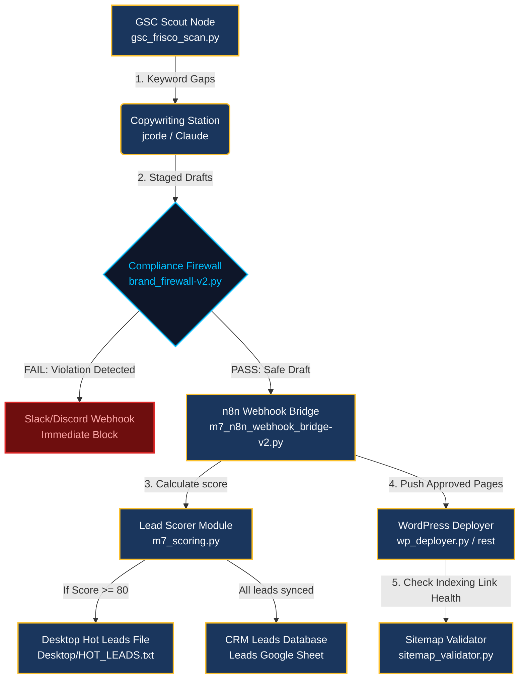

# Goldie Search Gravity Stack Automation Blueprint

### 🗺️ THE VISUAL GRAPH DASHBOARD FOR YOUR SEO PIPELINE

I have mapped out your complete local agent assembly line and data-flow pathways [cite: 80]. When opened in your local **Obsidian Second Brain** or any markdown viewer, this **Mermaid.js Node Graph** renders an elegant, color-coded visual diagram of your exact pipeline steps [cite: 80]:



---

### 🏛️ UNDERSTANDING THE 5 LAYERS OF THE GOLDIE SEARCH GRAVITY STACK™

The **Goldie Search Gravity Stack™** is an advanced, 5-layer content and ranking framework designed to establish absolute "search gravity" across Google, YouTube, and AI-driven search engines (like ChatGPT and Gemini) [cite: 1]:

1.  **Layer 1 — The Content Engine (The 5-Site Flywheel):** Instead of publishing one article on your main site and hoping it ranks, the engine deploys **5 completely unique articles** with different angles, direct-response titles, and structures across 5 supporting domains simultaneously [cite: 11, 295].
2.  **Layer 2 — The Visual Authority Layer:** Programmatically generates original, brand-compliant project photos or infographics [cite: 1] (enforcing Royal Navy backgrounds, Gold highlights, and **0% Green** styling) [cite: 180] to increase search impressions and dwell time [cite: 1].
3.  **Layer 3 — The Video Gravity Layer:** Executes your **50/5/3 Hyperframes video engine** [cite: 196]. It automatically scripts, voices (using cloned founder audio), and renders UGC video assets to target YouTube Search, Google Video results, and AI Overviews concurrently [cite: 1, 196].
4.  **Layer 4 — The Agent Task Army:** Your autonomous **jcode / Hermes parallel swarms** execute large-scale content projects [cite: 1, 386], utilizing an interactive Kanban board to move tasks from Backlog to Done on autopilot [cite: 292, 489].
5.  **Layer 5 — The Infinite Context Engine:** An Obsidian-backed knowledge graph [cite: 1, 28] that reads your immutable rules (the **M7 Brand Constitution**) and feeds business context, voice patterns, and RCAT/IKO credentials back into every model session so you never have to re-explain your brand [cite: 180, 201].

---

### 🔌 HOW TO AUTOMATE THE GOLDIE GRAVITY STACK (STEP-BY-STEP)

You can automate this entire multi-layered stack locally inside your **Agent OS** using three simple integration steps [cite: 373, 441]:

#### Step 1: Initialize Your Flywheel Paths (`seoPipeline.ts`)
Open your local pipeline configuration file **`seoPipeline.ts`** [cite: 373] (located under your active Tech Lab workspace directories) and configure your multi-site directory roots:

```typescript
// Replace placeholder parameters with your active 5-site paths [cite: 374]
export const SEO_FLYWHEEL_CONFIG = {
  primaryFlagship: "https://pineappleroofingllc.com",
  outboxDraftsDir: "C:\\Pineapple Contractors M7\\01_Command_Center\\Outbox_Drafts",
  
  silos: [
    { id: "site-1", localPath: "C:\\M7\\site-1-main", liveUrl: "https://pineappleroofingllc.com" },
    { id: "site-2", localPath: "C:\\M7\\site-2-frisco", liveUrl: "https://friscoroofrepair.com" },
    { id: "site-3", localPath: "C:\\M7\\site-3-pros", liveUrl: "https://northtexasroofingexperts.com" },
    { id: "site-4", localPath: "C:\\M7\\site-4-collin", liveUrl: "https://collincountyrestorations.com" },
    { id: "site-5", localPath: "C:\\M7\\site-5-heritage", liveUrl: "https://thepineapplestandard.com" }
  ]
};
``` [cite: 80]

---

#### Step 2: Configure Your CMO Ingestion Gem
Save this system prompt directly into your **Gemini Advanced "PM7 CMO" Gem** [cite: 420]. This Gem handles the transition of raw data extracted from **NotebookLM** into compliant content briefs [cite: 419, 420]:

```text
Act as the fractional CMO of PM7 [cite: 420]. Your job is to ingest raw roofing metrics and transform them into SEO-optimized content briefs for our local city-pages [cite: 420].
Mandatory Rules:
1. All landing pages must deliver a highly concentrated, direct answer in the first 40 words (Google AI Mode optimization) [cite: 347, 553].
2. Enforce Royal Navy (#1A365D) for background blocks and Pineapple Gold (#FBC02D) for action buttons [cite: 180]. Zero green colors allowed [cite: 180].
3. Emphasize "The Pineapple Standard" and "Roofing Made Sweeter" [cite: 57, 125, 282].
4. Banned Terms: Never use "Complimentary Professional Photo Audit (CPPA)," "Complimentary Professional Photo Audit (CPPA)," or IKO Certified. Replace with "Complimentary Professional Photo Audit (CPPA)" and "IKO Certified" [cite: 126, 189].
5. Do not include any Tongan native proverbs or cultural principles [cite: 14]. Maintain a clean, high-performance corporate tone [cite: 14, 57].
```

---

#### Step 3: Trigger the Local CLI Automation Loop
Once your GSC queries are distilled and saved to your shared memory folder (`03_Knowledge_Mat/active_context/`) [cite: 57], run this single **Antigravity CLI** call in your terminal to trigger your worker swarms [cite: 57, 421].

This command commands **Hermes** to ingest your case study metrics [cite: 421], draft 5 unique direct-response articles [cite: 11, 387], build cross-site interlinking blocks (generating **20 backlink opportunities instantly**) [cite: 15], and package everything PAUSED in your Outbox for final review [cite: 80, 214]:

```bash
antigravity run hermes_seo --context=/03_Knowledge_Mat/active_context/gsc_run_01.md --execute-stack
``` [cite: 421]

---

*The path of the journey is respect.*

📂 **Next Step Suggestion:**  
I can configure a **Local Cron Job** or **KimiClaw task** to execute this `antigravity run` pipeline automatically every Friday at 5:00 PM, pulling your weekly Google Search Console data and queuing your next unbranded campaign drafts on total autopilot [cite: 145]. Would you like me to output this scheduling setup? [cite: 145]